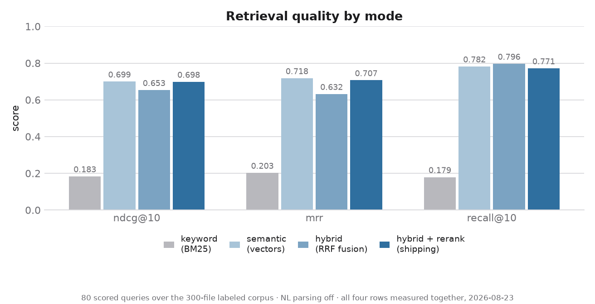
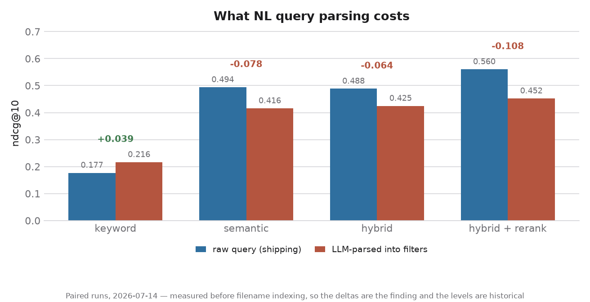
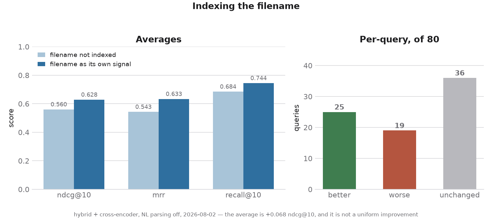

<div align="center">

# Oasis

**Does finding the right file feel like looking for an oasis in the Sahara desert?
Look no further, and find the file you forgot you made.**

Oasis is a native macOS app that searches your files the way you actually remember them —
*"that tax PDF from last spring"*, *"the deck about ML"*, *"the spreadsheet with Q3 revenue"* —
by reading what is **inside** them, not just what they are called.

Spotlight indexes shallowly and forgets the contents of formats it doesn't natively understand.
`grep` can't help when you only half-remember the wording. Oasis extracts the text out of PDFs,
Word documents, slide decks, spreadsheets, CSVs and Markdown, then runs keyword and semantic
retrieval over it together and reranks what survives.

**Everything runs on your machine.** No account, no cloud, no API keys, no telemetry —
the app doesn't even keep a request log, so your queries aren't written down anywhere.

<!-- SCREENSHOT: main window — query bar with a real query and the result grid beneath it.
     Drop the file at docs/img/app-main-window.png and replace this comment with:
      -->

</div>

---

## Install (macOS app)

> **⚠️ Draft, pending real-download verification.** Every step below was written
> against a locally built `Oasis.dmg` and a locally signed bundle. A DMG built on
> this machine carries **no `com.apple.quarantine` attribute**, which is the exact
> attribute Gatekeeper keys on — so mounting it here proves the image and the app
> are sound, and proves *nothing at all* about the first-launch experience of
> someone who downloaded it. The Gatekeeper wording, the number of clicks, and the
> Full Disk Access prompt all need one real download-and-open pass before this
> section can drop the warning.

**Download:** `Oasis.dmg` — **480 MB** (503,220,631 bytes). About **1.1 GB** once
installed. Most of that is the machine-learning stack: PyTorch, the embedding
model, and the cross-encoder reranker, all bundled so that Oasis never needs the
network.

1. Open `Oasis.dmg` and drag **Oasis** onto the **Applications** shortcut.
   (You *can* run it straight from the mounted image, but it is slower — the app
   is reading 1.1 GB through a compressed disk image — and the volume is
   read-only.)
2. Eject the disk image and launch Oasis from Applications.
3. macOS will refuse the first launch. That is expected — see below.

### Getting past Gatekeeper (first launch only)

Oasis is **ad-hoc signed and not notarized**, because it is distributed free and
notarization requires a paid Apple Developer account. macOS therefore treats it
the way it treats any app not blessed by Apple, and the first launch is blocked
with a message along the lines of *"Apple could not verify 'Oasis' is free of
malware."*

Clearing it takes one pass, once:

1. Try to open Oasis normally (double-click). Dismiss the warning dialog.
2. Open **System Settings → Privacy & Security**.
3. Scroll down to the **Security** section. There will be a line naming Oasis and
   a **Open Anyway** button next to it.
4. Click **Open Anyway** and authenticate with Touch ID or your password.
5. Confirm once more in the dialog that follows. Oasis launches, and every launch
   after this one is normal.

> **The old right-click → Open trick no longer works.** It was removed in macOS
> Sequoia; on current macOS, System Settings is the only route.

None of this is a statement about whether Oasis is safe — Gatekeeper is checking
for an Apple Developer ID signature and a notarization ticket, and an app that has
neither gets the same treatment whether it is a keylogger or a search tool. It is
routine for open-source apps distributed outside the App Store. The source is all
here if you would rather build it yourself; see
[`app/README-dev.md`](app/README-dev.md).

### What to expect on first run

- **A ~12-second first launch.** Oasis loads an embedding model and a
  cross-encoder reranker before it will accept a query, and it warms both with a
  throwaway inference so your *first* search isn't the slow one. Measured cold and
  fully offline: **11.63 s to ready**; **6.85 s** on later launches. The window
  shows a warming state until it's ready rather than accepting a query it can't
  yet answer.
- **No network, ever.** The models, the tokenizer, and the tiktoken encoding all
  ship inside the app. Oasis has been verified to launch, index, and search with
  **Wi-Fi off** and every model cache on the machine moved out of reach. Nothing
  you type and nothing in your files leaves your computer — there is no telemetry,
  no analytics, and no cloud API.
- **An empty index.** Oasis indexes nothing until you point it somewhere. Use
  **Index New Folder** and pick a directory; the first index of a large folder
  takes minutes and shows live progress you can cancel.

### Full Disk Access

> **Unverified.** The machine this was developed on does not gate `~/Documents`
> for *any* app — proven with three separate fresh-identity test bundles — so no
> valid observation of the permission prompt exists yet. The guidance below is
> what macOS's documented behaviour implies, not something that has been watched
> happen.

macOS restricts access to `~/Documents`, `~/Desktop`, and `~/Downloads` even for
apps that are not sandboxed. If you index one of those folders and Oasis reports
files it could not read, grant it access:

**System Settings → Privacy & Security → Full Disk Access → + → Oasis**, then
quit and reopen Oasis.

Oasis counts permission failures separately from genuine extraction failures
precisely so it can tell you *"macOS blocked this"* rather than *"indexed 0
files"*. Settings → General has a button that opens the pane directly.

---

## Using Oasis

Every control in the app is live. Here is each one, and what happens underneath it.

**The search bar.** Type a sentence and results appear. Every search runs the full
hybrid path — keyword and semantic retrieval together, fused, then cross-encoder
reranked — because that is the best-measured configuration and there is nothing to
choose. The query goes to the local server as one request; the server returns ranked
results with the matched terms already marked, and reports how long retrieval took.

**Result cards.** Each result shows a thumbnail, the document title, and a snippet with
your matched terms highlighted. Click one to open it in whatever app owns that file
type — a PDF in Preview, a `.txt` in TextEdit. You never have to reach for the mouse:
**arrow keys move the selection and Return opens it**, without leaving the query line.
Opening goes back through the server, which checks the path is one Oasis actually
indexed before handing it to macOS, and tells the app the difference between *"never
indexed"* and *"indexed, but the file has since moved."*

**⌘⌥O — summon from anywhere.** A global hotkey pops a borderless floating query line
over whatever app you're in, on the current Space. Type, press Return, and the main
window comes forward with the results. Oasis is menu-bar resident, so closing the
window doesn't quit it and the hotkey keeps working. The shortcut is rebindable in
Settings.

**Index New Folder.** Opens a folder picker, then starts indexing in the background —
it does not block the app. A progress sheet shows a live count while the folder is
being walked, switches to a real progress bar once the file count is known, and has a
**Cancel** button that takes effect within a fraction of a second. Cancelling keeps
whatever was already indexed; indexing is incremental, so the next run picks up where
it stopped.

**Reindex Current Folders.** Re-scans every folder you've indexed, one after another.
Unchanged files are skipped by a `(size, mtime)` check, new and edited files are
re-indexed, and files that have been **deleted from disk are removed from the index** —
the sheet reports how many. If a folder can't be read the sequence stops and says
which one, rather than silently doing half the job.

**Indexed File Statistics.** Document count, index size on disk, when it was last
indexed, whether semantic search is ready, and the list of indexed folders. It also
words the two states that would otherwise look like breakage: an index built before
embeddings existed says *reindex recommended* rather than quietly returning nothing,
and files that have gone missing from disk are counted so you know a reindex has
something to clean up.

**Reset Indexing.** Wipes the index behind a confirmation that names how many documents
you are about to lose. Afterwards the app drops to its empty state and is immediately
ready to index again — no restart. It's disabled while an index job is running.

**Settings (⌘,).**

| | |
|---|---|
| **General** | Launch at login, number of results to show, reveal the index file in Finder, and a Full Disk Access explainer with a button that opens the right System Settings pane |
| **Folders** | The folders Oasis has indexed, with a **Remove Folder** action — the recourse when a folder is gone from disk and you just want Oasis to forget it |
| **Shortcuts** | Rebind the ⌘⌥O summon hotkey |
| **About** | Version |

---

## Looking Under The Surface: The Architecture of Oasis

```
                    a sentence you typed
                             │
              ┌──────────────┴──────────────┐
              ▼                             ▼
    ┌───────────────────┐         ┌───────────────────┐
    │  SQLite + FTS5    │         │      LanceDB      │
    │  BM25 keyword     │         │   dense vectors   │
    ├───────────────────┤         ├───────────────────┤
    │ filename          │         │ filename chunk    │
    │ path              │         │ content chunks    │
    │ title             │         │                   │
    │ content           │         │  cosine, 384-dim  │
    └───────────────────┘         └───────────────────┘
              │                             │
              └──────────────┬──────────────┘
                             ▼
                 ┌───────────────────────┐
                 │  Reciprocal Rank      │   rank-based, k=60
                 │  Fusion               │
                 └───────────────────────┘
                             ▼
                 ┌───────────────────────┐
                 │  Cross-encoder rerank │   top 20 candidates
                 │  (query, passage)     │   → top 10 shown
                 └───────────────────────┘
                             ▼
                        what you see
```

**Extraction.** One module per format — PDF (pypdf), Word, PowerPoint, Excel, CSV, and
plain text/Markdown — behind a uniform interface. Extraction is **partial-success**: a
single corrupted page in a PDF is caught, logged, and skipped rather than losing the
whole document, which for real-world PDFs is the common case rather than the edge one.

**Chunking, and the filename as its own signal.** Extracted text is split into
overlapping 500-token windows (50-token overlap) so a passage that straddles a boundary
is still findable. Separately, **the filename is treated as a signal in its own right** —
the one piece of metadata a person actually *chose*, and often the only place the word
they'll search for is written down. A shared normalizer turns `Q3ReportFinal.pdf` into
`Q3 Report Final` and `paper-okapi-at-trec3.pdf` into `paper okapi at trec 3`, splitting
on case and letter/digit boundaries that a standard tokenizer treats as one opaque word.
That text goes into a dedicated weighted FTS column **and** is embedded as its own vector
chunk. One normalizer, three consumers — the keyword column, the embedded chunk, and the
reranker's passage — so they cannot disagree about what a filename says.

A useful side effect: a scanned PDF with no extractable text at all used to be invisible
to semantic search. Now it is findable by what you named it.

**Two indexes.** SQLite with FTS5 for BM25 keyword matching over four weighted columns,
and LanceDB for cosine similarity over 384-dimensional embeddings from
`all-MiniLM-L6-v2`. Indexing is incremental — a `(size, mtime)` hash skips unchanged
files — and a reindex reconciles deletions out of both stores.

**Retrieval.** Both arms run on every search and are fused with **Reciprocal Rank
Fusion**, which combines rank positions rather than scores and so needs no calibration
between BM25 and cosine distance. The top 20 survivors are then rescored by a
cross-encoder that reads the query and the passage together. **The two arms fail
independently**: a query that FTS5 can't parse degrades the search to semantic-only
instead of returning nothing, and a vector-store failure degrades it to keyword-only.
Only if both fail does a search actually error.

**Why there is a Python server inside a Swift app.** The retrieval engine is Python —
that's where the embedding and reranking models live. Rather than reimplement any of it
in Swift, the app spawns the bundled engine as a child process on startup, talks to it
over a loopback socket, and shuts it down on quit. The socket is bound to `127.0.0.1`
only and protected by a token generated fresh at each launch. This seam is also what
makes "one engine, many front-ends" true rather than aspirational: **a command-line
front-end exists over the exact same retrieval code**, so any change to ranking shows up
in both without being written twice.

**On-device, end to end.** Both models, the tokenizer and the text encoding ship inside
the app bundle, and the engine is launched with network fetching disabled. The only
socket Oasis opens is its own loopback one.

> The engine also contains a natural-language parsing layer that turns a sentence into
> typed filters (file types, date ranges, folders). **It is off, and the app never calls
> it** — the eval measured it as a clear regression. See below.

---

## Measured results

Every number here is reproducible with `eval/run_eval.py` over a **300-file labeled
corpus** and **83 queries** (80 scored, 3 expected-empty), with `today` pinned to
`2026-07-07`. The charts are generated from the committed result files by
[`eval/plot_readme.py`](eval/plot_readme.py) — no figure in this section is typed in by
hand.

### The shipping configuration



| mode | ndcg@10 | mrr | recall@10 | p@5 |
|---|---|---|---|---|
| keyword (BM25) | 0.1835 | 0.2025 | 0.1792 | 0.0625 |
| semantic (vector) | 0.6994 | 0.7177 | 0.7817 | 0.2700 |
| hybrid (RRF) | 0.6531 | 0.6317 | **0.7963** | 0.2650 |
| **hybrid + cross-encoder** (what the app runs) | **0.6981** | **0.7066** | 0.7713 | 0.2625 |

*All four rows measured together, 2026-08-23, NL parsing off.*

Three honest readings of that chart, including one that doesn't flatter the architecture:

- **The keyword row is a strawman.** Feeding a whole sentence to FTS5 ANDs every term, so
  most keyword queries return nothing. The keyword-vs-hybrid gap is inflated and
  shouldn't be quoted as an argument for anything.
- **Fusion buys recall; the reranker converts it into ranking.** Hybrid has the best
  recall@10 of any row (0.7963) and the worst ranking of the three real rows (0.6531
  ndcg). The cross-encoder is what turns one into the other, +0.045 ndcg over raw fusion.
  Neither half is useful alone.
- **But semantic alone is level with the shipping configuration on this corpus — very
  slightly ahead.** 0.6994 vs 0.6981 ndcg@10 is noise; 0.7177 vs 0.7066 mrr probably
  isn't. The extra machinery is not currently paying for itself *here*, and saying so is
  the point of publishing the whole matrix rather than the winning row. The honest reading
  is that the case for hybrid is robustness — it is the arm that still answers when a
  query is a filename, an exact phrase, or something the embedding model has never seen —
  and this corpus, 80 well-formed natural-language questions, is close to the best case
  for a pure vector search. **That's an argument a second corpus settles, not a paragraph**
  (see [Moving Forward](#moving-forward)).

### The headline finding: NL parsing made retrieval *worse*



The project was premised on the bet that a local LLM parsing queries into structured
filters would beat feeding the sentence straight to hybrid retrieval. **The eval measured
that bet and it lost** — on the shipping mode, **−0.108 ndcg@10 and −0.135 recall@10**.
19 of 80 queries went from finding the answer to finding *nothing*.

| mode | raw | parsed | Δ |
|---|---|---|---|
| keyword (BM25) | 0.1768 | 0.2163 | **+0.040** |
| semantic (vector) | 0.4937 | 0.4156 | −0.078 |
| hybrid (RRF) | 0.4884 | 0.4246 | −0.064 |
| **hybrid + cross-encoder** | **0.5602** | 0.4522 | **−0.108** |

*Paired runs, 2026-07-14 — measured before filename indexing, so the deltas are the
finding and the absolute levels are historical.*

Two verified mechanisms:

1. **Hallucinated hard filters exclude the answer.** `"ffmpeg convert video"` →
   `file_types: ['.mp4','.mov','.avi']` — the model confused the *topic* of the document
   with the *type* of it. The answer is a `.md` file, and Oasis doesn't index `.mp4` at
   all. Recall → 0.
2. **Distilling the query for the embedder destroys meaning.** *"speech asking citizens
   to serve their country rather than be served"* → `'civic duty'`, which embeds nowhere
   near the JFK inaugural. *"rising ocean temperatures are killing the reef"* → `'ocean
   pollution'`, which is a different phenomenon.

The root cause is an **asymmetric payoff, not a bad prompt**: a correct hard filter helps
marginally, a wrong one zeroes recall, and a 3B model is wrong often enough that the
expected value is strongly negative. No amount of prompt-tuning changes that shape.

**So the layer is measured, written up, and switched off.** It stays off until it is made
soft — a score boost rather than a `WHERE` exclusion — and re-measured. This is the
single most useful thing the eval harness did: it killed the feature the project was
named after.

### The filename signal: +0.068 ndcg@10, and what it costs



Treating the filename as its own indexed signal moved hybrid + cross-encoder from
**0.5601 → 0.6280 ndcg@10** (+0.068), with recall@10 0.6844 → 0.7442. Almost all of it
is the *vector* chunk: measured on the semantic arm alone it is worth **+0.206 ndcg@10**
(0.4937 → 0.6994) — the largest single retrieval change made in this project. The BM25
column weights, by contrast, changed nothing end to end: swept from flat to 32× filename,
every setting produced identical hybrid numbers, because fusion consumes only rank order
and the reranker rescores the top 20 from scratch.

**It is not a uniform improvement, and reporting the average alone would be the
misleading half.** Of 80 queries: **25 got better, 19 got worse, 36 didn't move.** The
gains are large and the losses are small, which is why the average moves so far, but the
losses have a shape worth knowing:

- **Helps** when a name is distinctive. The two queries tagged *filename-only* went from
  0.3155 to a perfect **1.0000** — a small sample, but the change is exactly what they
  test. The eight CSV queries, whose files have descriptive names and near-unreadable
  bodies, went 0.3385 → **0.6942**.
- **Hurts** when many files share a name stem and something *other* than the name is
  meant to discriminate. `"contracts from 2023"` has seven `contract-*.docx` files that
  now all match strongly on the name, crowding out the two the date is supposed to pick.
  Boosting names necessarily boosts near-duplicates that share one.

**One more step got it to the shipping number.** Indexing filenames briefly made the
cross-encoder *net-negative* — a document surfaced by its name arrived carrying a keyword
snippet about something else, so the reranker buried what retrieval had just found. The
fix was to judge each candidate on coherent prose (its best-matching **content** chunk,
with name chunks excluded) instead of a 20-token keyword fragment, which took the
configuration from 0.6280 to the **0.6981** in the table above. Notably, a *longer*
fragment was worth nothing — 20 to 200 tokens moved the metric less than noise. What the
model lacked was prose, not characters.

**And the corpus flatters it.** These filenames were authored to be self-describing
(`manual-espresso-machine-em500.pdf`). Real folders are full of `Document (1).pdf` and
`IMG_4032.HEIC`, where the name carries no signal at all — so **+0.206 is an upper bound,
not an expected value.**

### On latency

Deliberately blank. One search on the shipped bundle measured 394 ms server-side against
a 300-document index, but a real p95 budget has **not** been established, and quoting a
single number as if it were one is exactly the failure this eval discipline exists to
prevent.

---

## Project state

| Piece | State |
|---|---|
| Extraction, keyword index, vector index, hybrid retrieval + rerank | **Done**, measured, 1001 tests passing |
| Filename as its own indexed signal | **Done** — weighted FTS column *and* its own embedded chunk; **+0.068 ndcg@10** |
| Evaluation harness | **Done** — 300-file labeled corpus, 83 queries, reproducible matrix |
| Natural-language query parsing | **Built, measured, disabled** — a **−0.108 ndcg@10** regression; the app never calls it |
| macOS app (SwiftUI) | **Feature-complete** — search, indexing, statistics, reset, ⌘⌥O summon, menu-bar residency, Settings |
| Packaging | **Built, not yet published** — self-contained `.app` (1.1 GB), ad-hoc signed inside-out, **480 MB** DMG, deliberately not notarized |

The DMG is built and verified locally but **not hosted anywhere yet**, which is why the
install steps above carry a draft banner. Until then, running Oasis means building it
from this repo — see [`app/README-dev.md`](app/README-dev.md).

---

## Stack

| Layer | Tool |
|---|---|
| App | SwiftUI, menu-bar resident, spawns the engine as a child process |
| Engine | Python 3.14, managed with `pixi` (conda-forge + PyPI under one lock) |
| Keyword index | SQLite + FTS5 (BM25, porter stemmer) |
| Vector index | LanceDB (cosine, embedded) |
| Embeddings | `sentence-transformers/all-MiniLM-L6-v2` (384-dim) |
| Reranker | `cross-encoder/ms-marco-MiniLM-L-6-v2` |
| App ↔ engine | FastAPI + uvicorn over loopback, bearer token, SSE for indexing progress |
| Packaging | PyInstaller `--onedir`, embedded in `Oasis.app/Contents/Resources/` |
| Inference | CPU by default (conda-forge torch, OpenBLAS) |
| Eval | `ranx` over a labeled corpus; results committed under `eval/results/` |
| Tests | pytest — **1001 tests**, all passing |

---

## Design decisions

The trade-offs that actually shaped the project.

- **Reciprocal Rank Fusion instead of score normalization.** BM25 and cosine distance
  live on different scales, and calibrating between them is a tuning problem with no
  stable answer. Rank-based fusion sidesteps it entirely.
- **Cross-encoder rerank on the top 20 only.** Cross-encoders are accurate and slow.
  Reranking a small candidate pool captures most of the quality at a fraction of the
  cost — and the recall for it to work with comes from fusion, which is why the two
  belong together.
- **The two retrieval arms fail independently.** They used to share one error path, so a
  stray apostrophe in a query took the semantic arm down with the keyword one and the
  whole search returned nothing. Degrading beats erroring when half the system still has
  a good answer.
- **Local models, not a cloud API.** People are searching their own files. The
  cloud-LLM path that once existed was removed outright rather than left as a setting —
  offline operation is a product requirement, and a setting is something that can be
  switched on by accident.
- **Measured before shipped, and switched off when the measurement said so.** The NL
  parsing layer was the project's premise and it is disabled, with the numbers published.
  An eval harness that can only confirm your plans isn't one.
- **CPU inference on conda-forge torch, not the PyPI wheel.** Every stock macOS-arm64
  torch wheel links Apple's Accelerate BLAS, whose SGEMV path returns *all-NaN*
  cross-encoder logits on this macOS — and NaN scores don't raise, they silently degrade
  reranking to no reranking at all. conda-forge's OpenBLAS build fixes it, and that is
  the entire reason the project is on `pixi`.
- **Ad-hoc signed, not notarized.** Notarization requires a paid Apple Developer account
  and Oasis is free. Ad-hoc signing still buys what matters: arm64 requires every binary
  to be signed to run, the bundle is internally consistent, and tampering is detectable.
  The cost is real and the user pays it exactly once, at first launch.
- **No App Sandbox.** Sandboxing is mandatory for the App Store and nothing else, and it
  forbids exactly the two things this app is: spawning an engine process, and indexing
  arbitrary folders you choose. Not debt — architecture.

---

## Moving Forward

**What worked.**

The eval harness paid for itself by killing a feature rather than confirming one. Oasis
was premised on LLM query parsing; the harness measured it as a −0.108 ndcg@10 regression
and it was switched off with the numbers published. A harness that can only validate is
decoration — this one changed the product.

Hybrid retrieval plus a cross-encoder is defensible on mechanism: fusion supplies recall,
the reranker converts it into ranking, and the matrix shows neither half doing the job
alone. What it has *not* yet earned is its margin — on this one corpus semantic-only ties
it — and holding that distinction rather than quoting the winning row is the same
discipline that killed the parsing layer. The local service seam earned its complexity —
one Python
engine serves every front-end over the same code path, so a ranking change lands
everywhere without being written twice, and the seam is verified rather than assumed:
the eval re-runs itself through the server and asserts the served rankings are identical
to calling the retrieval code directly.

And measuring rather than assuming caught things that would otherwise have shipped
silently: a BLAS backend returning NaN logits that degraded reranking to nothing without
raising, an app-spawned inference device that aborted only under a GUI parent, and a
frozen bundle that resolved its models from the network in a test that looked like it was
proving the opposite.

**What's still open.**

**One eval corpus is not enough, and it's the biggest hole.** Every number here rests on a
single 300-file corpus, and two of the three headline results lean on its particular shape:

- Its filenames were authored to be self-describing, which is exactly the property the
  filename change benefits from — so **+0.206 is an upper bound by construction.**
- Its 80 queries are well-formed natural-language questions, which is close to the best
  case for pure vector search — which is why **semantic alone currently ties the shipping
  configuration** in the matrix above. The cross-encoder's contribution has already moved
  twice as other parts changed (it went net-negative when filenames were first indexed,
  then recovered). Whether hybrid + reranking is worth its complexity is genuinely
  unsettled, and it will stay unsettled until it is measured against a corpus built from
  files nobody wrote for an eval, with queries nobody wrote for the corpus.

**The NL parsing layer could plausibly become net-positive**, and the fix is specific:
make the filters soft (a score boost, not a `WHERE` exclusion) so a wrong guess costs a
little instead of zeroing recall, and embed the user's actual words rather than the
model's distillation of them. Both are small changes. Neither ships until it's measured,
and if it stays negative the layer gets deleted with the numbers attached.

**Bundle size is the concrete argument for a Core ML / MLX swap.** A 480 MB download for a
file search tool is a lot to ask, and most of it is PyTorch rather than the models — which
are 175 MB between them. Apple-native inference would cut the download substantially and
likely start faster, at the cost of maintaining a second inference path.

**Notarization becomes worth it if distribution widens.** Today the Gatekeeper detour is a
one-time inconvenience documented above. If Oasis is ever meant for people who won't read
a README, that stops being acceptable and a Developer ID is the answer.

Smaller and genuinely useful: background indexing via FSEvents so the index stays current
without being asked, OCR for scanned PDFs (findable by name today, not by content), and
more formats — email, images, code.

**Explicit non-goals:** no cloud sync, no hosted index, no remote LLM; not multi-user; not
mobile; not the Mac App Store; not competing with Spotlight on exact-filename lookup.
